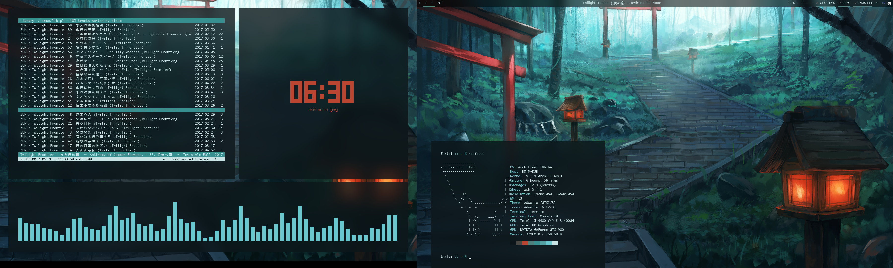

# Dotfiles

So as the name would suggest this is where I'll be keeping a copy of my dotfiles so that configuration is as easy as cloning the repo.
I'll probably also add in some kind of script to automatically configure everything as well.

## Setup/configuration

Ideally it'll be as simple as running a script that I'll write to just symlink everything to where it should be, and then it can be edited from here.
That would be great!

## Dependencies

These are all of the dependencies and applications that need to be installed/that I use.
I'm assuming for the most part that the end user for this repo is using Arch Linux, because that's what I use (btw).

### Applications

- i3-gaps
- termite
- rofi (dmenu replacement)
- i3lock-fancy-dualmonitor
- polybar
- redshift
- compton-tyrone-git
- twmnd (notification system thing)
- cmus
- pywal
- zsh/oh-my-zsh
- w3m
- pluggy/vim plugin manager
- escrotum

### Fonts and more

- DejaVu Sans Mono
- Monaco
